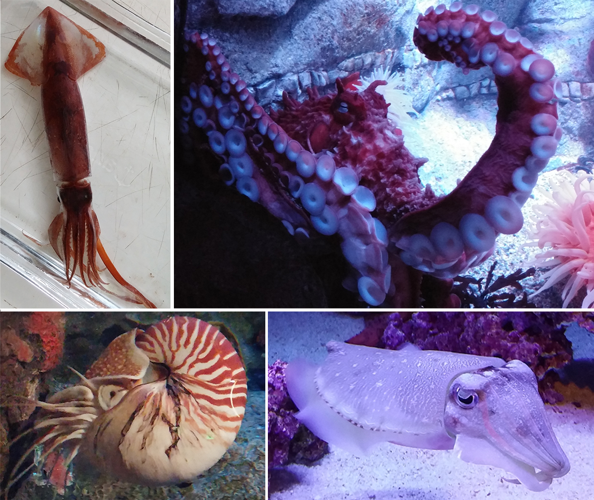
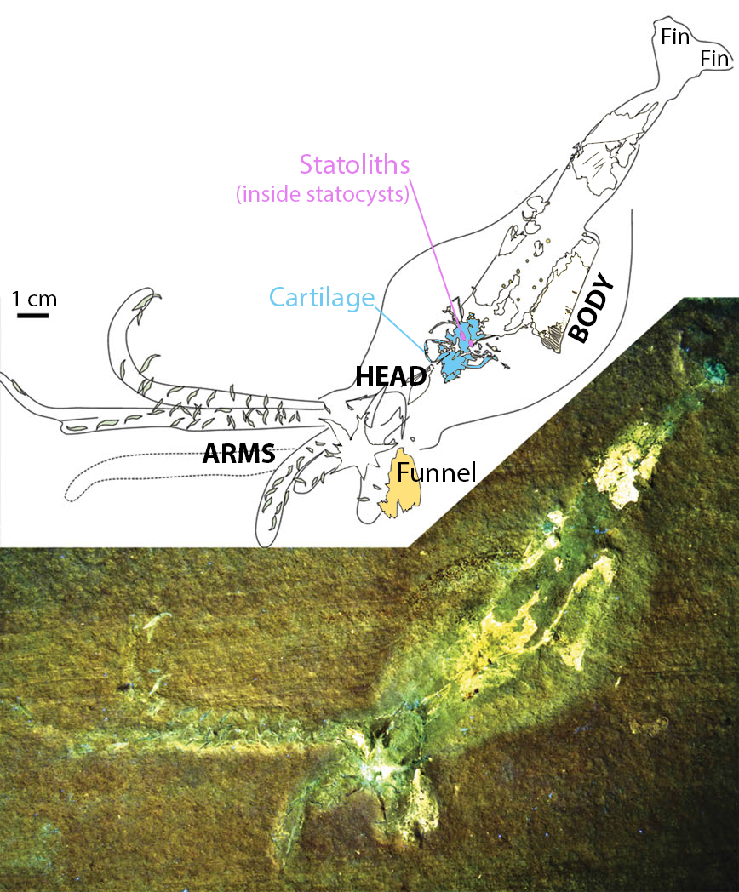

*This American Museum of Natural History diorama depicts ancestors of the cephalopods, the group that contains modern-day squid, octopus, cuttlefish, and nautilus. Photo credit: Diana Li*

What if you had to wear a huge backpack all the time? Quick, agile movements would become much more difficult, and you’d probably get tired pretty fast. Maybe you would downsize the items in your pack to fit into your pockets. Or you might change your way of life and get rid of material possessions altogether. These were the issues that ancient ancestors of the squid faced when they began to free themselves from life on the seafloor 400 million years ago. Abundant fossils of preserved hard parts give clues to what these ancestors probably looked like: Imagine a modern squid curled up and stuffed into a cumbersome shell, limited to crawling on the seafloor. But with all that bulk on their backs, scientists still puzzled over how the ancient animals might have moved. Direct observation of extinct animals is impossible, but [recent fossil finds](http://rsbl.royalsocietypublishing.org/content/12/1/20150877) of soft body parts may provide an answer. 

Today’s squid are impressive – they have the [biggest eyes](http://squid.tepapa.govt.nz/anatomy/article/the-eye-of-the-colossal-squid) of any animal relative to their overall size, they can be [as long as a school bus](http://ocean.si.edu/giant-squid), and they can [jump to glide above the water](http://www.scientificamerican.com/article/can-squid-fly/) for several feet. But squid weren’t always this glamorous. In fact, the earliest ancestor of the squid was a humble snail-like creature about an inch long that lived 500 million years ago during the Cambrian Period (300 million years before the dinosaurs in the Triassic). Though fossils of this earliest ancestor are incomplete, scientists believe this animal’s shell was filled with air and sat on its body like an oversized party hat. Having a big clumsy shell wasn’t the most streamlined shape for speedy swimming, but it was a great innovation at the time. It made the snail buoyant. 

Buoyancy makes an animal lighter than the surrounding water, so our ancient snail was able to hover above the seafloor. Leaving the seafloor could vastly increase access to food, habitat, and mates. Sounds like a recipe for success, right? Unfortunately, hovering also exposed animals to more predators. Our party-hat snail could suck water into its shell to sink or let out water to float; however, it just didn’t have the muscles to quickly escape from an animal that thought it would be a yummy snack. To protect itself, it still had to stay close to shallow seafloors and hide in its shell. Retreating into the darkness of the deep ocean wasn’t really an option either because the high pressure in the deep would implode its thin shell. Numerous types of party-hat snails began trying out different shell shapes and body structures to see who could gain the most food and mates by floating without being eaten. At the same time, predators were trying out new strategies, like jaws and fins, that enabled them to capture food more effectively. 

After 100 million years of troubleshooting, two winning features emerged: (1) stronger, coiled shells suited for the pressure of deep water where animals could avoid shallow-water predators, or (2) smaller shells gradually getting surrounded by soft muscle, foreshadowing a totally new body type. Strategy 1 eventually yielded the present-day nautilus, famous for its iconic spiral shell. But Strategy 2 would end up being a radical development. It allowed the party-hat snails to squeeze water out of their bodies to produce a jet, whisking them away from predators. Eventually, the need for stronger muscles and faster movement resulted in the muscle bulging out so much that it completely covered the shell. The shell became internalized. 

*Modern-day cephalopods include (clockwise from top left) squid, octopus, cuttlefish, and nautilus. Only nautilus has kept the external shell whereas the squid and cuttlefish have internal shells, and the octopus has lost it altogether. Photo credit: Diana Li*

This internalized shell represented a “best of both worlds” body plan. It allowed squid ancestors to hover and sink using the remnant internal shell, but they could also jet around near the seafloor. So when did these ancestral creatures abandon the seafloor for good and evolve into today’s free-swimming squid? Until now, scientists could only guess. But the recent discovery of three exceptionally preserved soft tissue fossils in Germany have provided the first tangible evidence of a free-swimming lifestyle in an ancestral squid. 

In their [new study](http://rsbl.royalsocietypublishing.org/content/12/1/20150877) published this year in the academic journal *Biology Letters*, Dr. Christian Klug and colleagues reveal that the belemnite, a Jurassic ancestor of the squid that lived 200 million years ago, was likely a fast swimmer that no longer lived near the seafloor. It is extremely rare to encounter fossils that preserve soft tissues like muscles and organs; they are usually among the first to be lost to time. However, the right chemical and physical environment created the perfect conditions for the preservation of these animals. 

A first, careful look at the fossils confirmed the presence of fins and a well-developed, muscular soft body. The idea of belemnites with fins had been posited over a century ago, but it was based solely on vague folds in the rock near the tip of the animal. The German fossils have validated this century-old idea. Fins are integral to swimming in modern squids, which flap or undulate their fins in order to hover, stabilize, and maneuver. Scientists think that belemnites would have used their fins in the same way. 

Whereas the fins and body were relatively easy to distinguish on the fossil, other organs were less obvious and even invisible without proper illumination. After trying many imaging techniques, co-author of the study Dr. Helmut Tischlinger was able to capture the moneyshot – fossilized imprints of the statocysts, cartilage, and funnel – using ultraviolet light. 

*A fossilized belemnite is illuminated by ultraviolet light. The corresponding drawing labels key body parts. Photo and drawing used with permission from the authors and modified by Diana Li.*

For a fast-moving animal, a sense of balance and position in the environment is crucial. Statocysts are balance organs found in squids and many other marine animals. They provide a sense of changes in the animal’s orientation and speed, and their presence supports the idea that belemnites could swim speedily. Moreover, the study provided the first observation of a fossilized funnel, the opening through which the animal would push out its jet of water. Also present were cartilaginous structures anchoring the head and funnel regions to the rest of the body. Although not at strong as bone, cartilage prevented the head from detaching during a strong jet. If only half the squid managed to jet away from a predator, it would still be as dead as a whole squid that got eaten.

These new fossils showed us how ancient belemnites abandoned the seafloor and became ancestors of today’s agile squid, yet more questions still remain. How deep in the ocean did the belemnites live? Did they swim long distances like many modern squid? We can only assume the belemnite’s ancient funnel and fins developed into the structures seen today. Much like shedding items from a big backpack, we imagine the belemnite’s internal shell shrinking as squids and cuttlefishes evolved, and disappearing altogether for squishy shallow-water octopuses. But other strange ancient body plans may still be found that change this picture of squid evolution. Until a real life time machine is created, or a time submarine for that matter, we’ll have to keep digging for more fossils to piece together this skeleton story. 
