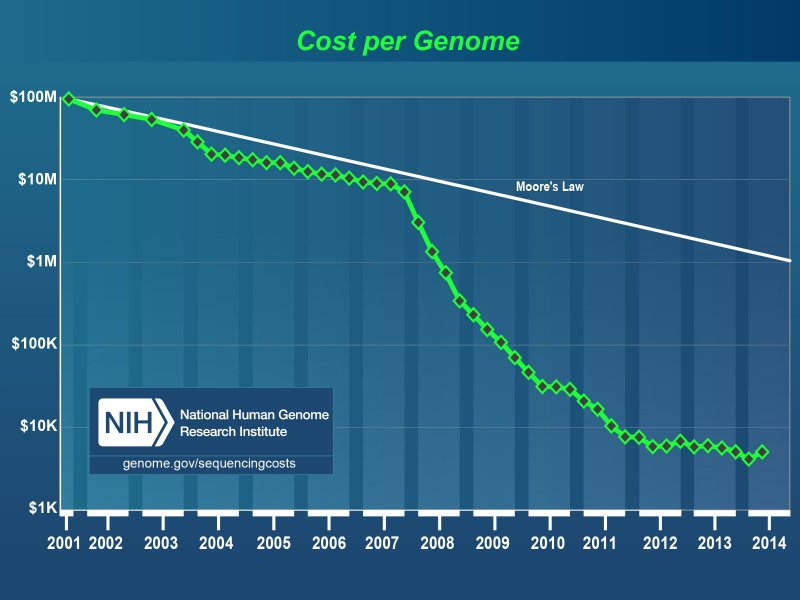

####A Time To Be Alive

While I was watching TV recently, a commercial came on that caught my eye. It was advertising for 23andMe, a company that analyzes a sample of your DNA for ancestry and health information. Knowledge of your ancestral origins and your risk for genetically based diseases can now be yours for a few hundred dollars and a mailed DNA sample. Crazy, right?

This all sounds like magic, so how exactly does it work? Well, we are all made up of cells. Each of these cells has a copy of our **genome**, the set of DNA that defines all of our traits. DNA consists of long sequences of nucleotides (A's, C's, G's, and T's), which when "read" by our cells, instructs everything our cells make and do. Our spit contains cells that have detached from the insides of our cheeks, making spit a convenient method for getting a DNA sample [1]. This DNA is then purified from the spit and deciphered by DNA sequencing technology [2].

####The First Genome

Large-scale DNA sequencing of the whole genome has been on the rise for the past few decades. At the forefront of this effort was the **Human Genome Project**, which strove to sequence the entire human genome. In 2001, they published the majority of the genome sequence (about three *billion* nucleotides!) to the world [3]. By 2003, the project was declared complete. Sequencing the human genome was seen as a huge scientific feat that paved the way for the era of **genomics**, the use of bioinformatics to assemble and analyze the function of genomes.

The Human Genome Project took several years and several million dollars to complete just one genome sequence. How can you now get your DNA sequenced in fewer than eight weeks for only $200? Well, large-scale DNA sequencing methods have continued to improve in the fifteen years since the genome was first sequenced. These advances have increased speed and decreased the cost of sequencing per nucleotide, allowing for a greater volume of sequencing for a lesser price [4]. In fact, this advancement has occurred faster than was initially predicted! In what became known as Moore's law, Intel co-founder Gordon Moore accurately predicted that the complexity and capacity of electronic circuits would double every two years. One might expect this prediction to apply to genome sequencing, which requires the computational analysis of large amounts of sequencing data. Amazingly, the cost of genome sequencing has fallen by more than half every year since the completion of the Human Genome Project, faster than the rate predicted by Moore's law.

Companies such as 23andMe can further reduce the price of obtaining genetic information by analyzing **single nucleotide polymorphisms**, or SNPs, instead of sequencing the entire genome. While every human genome is 99.9% similar, the 0.1% of difference accounts for the diversity we see in the human race. One such type of difference is a SNP, which is the change of a single nucleotide in the genomic sequence. There are over a million known SNPs in the human genome. Through the use of **genome-wide association studies**, many SNPs have been correlated with certain traits and diseases. Thus, it's possible to discern genetic traits from people’s SNPs without reading their entire genome [5]. Not only that, this greatly cuts the price of genomic analysis, which is already getting cheaper and cheaper.

####A New Era

We may indeed be standing at the cusp of a new era when everybody knows his or her genetic makeup. We would all know our risks of cancer, bipolar disorder, and all other diseases affected by genetics. Think about it this way: cell phones became commercially available in 1983 and grew exponentially in use. Now everybody has a cell phone, many of which are smartphones, and some of us (myself included) cannot even last the duration of an elevator ride without checking it. Commercialized genome sequencing is also quickly becoming more popular and available. Some people are even starting to use it to analyze their genomes, so we might find that in a few decades, it will be as common as the iPhone.

A world of genomic sequencing could be a really good one. It would improve things like **personalized medicine**, medical treatments that are tailored to the patient on a case-by-case basis. If doctors know key pieces of information about a patient's genetic background, they can make more informed decisions about how to treat the patient's illness. In addition to personalized medicine, if genetic analysis reveals that a person is at risk for breast cancer or diabetes, steps can be taken to address these risks, such as mammograms and dieting. Clearly, genome sequencing is a tool that can save and improve lives.

####The Dark Side

However, there is a dark side to commercially available genome sequencing as well, namely through the form of **genetic discrimination**. If information of your genome is widely available, people might discriminate against you based on the status of parts of your genome. Consider, for example, that your health insurance company raises your insurance rates because you have a high genetic risk of becoming diabetic, or a potential employer does not hire you because you are likely to develop early-onset Alzheimer's disease. Such ideas are touched on in the film *Gattaca*, which takes place in a dystopian eugenics society that classifies people by their genetic makeup.

Thankfully, we are protected from genetic discrimination by the **Genetic Information Nondiscrimination Act (GINA)** of 2008. Under this act, genetic information cannot be used to discriminate in health insurance or employment. Hopefully moving forward, laws like this will allow us to use genetic information to improve lives and inform us of potential health risks without issues of discrimination. As the cost of sequencing continues to decline and commercial sequencing companies grow, it will be interesting to see how the genomic era unfolds.

####References

1. Gilbert and Vance, *Current Protocols in Human Genetics*, 2001
2. Erickson et al, *BMC Medical Genetics*, 2012.
3. Venter et al, *Science* 2001.
4. Christensen et al, *Journal of Personalized Medicine*, 2015
5. Jiang et al, *International Journal of Biological Sciences* 2016.

####Recommended Further Reading

* Human genome project: http://www.genome.gov/12011238
* Information on GINA: http://ginahelp.org
