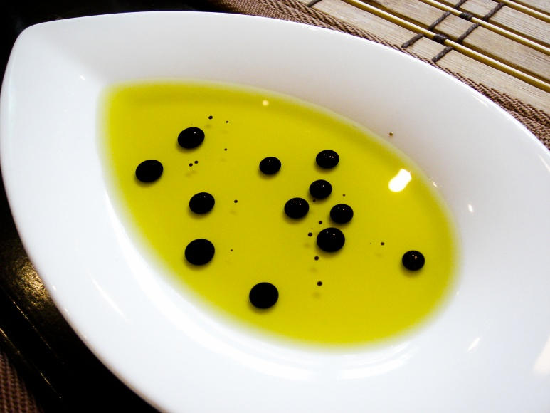

###Protein crowding inside the cell

Think about your cells. Are they solid? Not really. A cell can be thought of as a bag (made of this stuff called the [plasma membrane](http://www.nature.com/scitable/topicpage/cell-membranes-14052567)) thatís full of all the things that make you, your DNA, proteins, and all sorts of different things. Itís really, really crowded (see the picture above for an idea of what the inside of a cell might look like). And for the most part, all of these contents are more of a liquid than a solid, although there are some components, particularly the proteins responsible for cell structure, that behave more like solids. Some cellular contents, like DNA for example, are bundled up in different compartments, called [organelles](http://biology.about.com/od/cellanatomy/ss/organelles.htm), made of the same plasma membrane that surrounds the whole cell, but the rest of it is all packed into the inner-cellular space and referred to collectively as the [cytoplasm](http://biology.about.com/od/biologydictionary/g/cytoplasm.htm). But this implies that all of these essential biological components are just thrown together in a big bowl of cytoplasm soup, and thatís just not the case. If you look at all of life, some cells are free-living and some cells work together to make complex organisms like plants and animals. But all cells need to understand and interact with whatever is around them, whether this means looking for microscopic prey or sending nutrients to neighboring cells to keep an organ working. A bag full of random soup just isnít going to be able to do all the things that cells need to do.

So how do our cells make sense of all the different interrelated liquid parts that make them up? Phase separation. Phase separation describes the separation of liquids, gasses, and solids (different phases of matter) but it can also refer to the tendency of some liquids to stay separate, like oil and vinegar in a vinaigrette. Liquids like these have inherent chemical differences that make the molecules of one liquid repulsive toward molecules of another liquid but attracted to themselves. Therefore, liquids in this situation like to segregate into separate parts that we can also call [phases](http://www.bbc.co.uk/schools/gcsebitesize/science/add_edexcel/covalent_compounds/seperationrev1.shtml). The different liquid phases in a mixture can distribute as layers or as droplets of one liquid within another.

**Figure 1: Oil and vinegar separating into two separate phases.**

In a way, the plasma membranes that compartmentalize cells and the organelles inside of them are just another form of phase separation (the fats that make up the membrane form a bubble), but this sort of compartmentalization has been understood for a while. In the past few years, itís become increasingly clear that the cytoplasm is also organized through phase separation. The cell can concentrate different proteins and nucleic acids into temporary phase-separated liquid droplets that can perform specific tasks to help the cell respond to the world around it. Because theyíre free from any membrane, these liquid droplets can quickly form to get their jobs done. These droplets tend to be a bit thicker than water, and when some of the protein components are isolated in the lab (and chilled a bit) they often form a type of substance, called a hydrogel, that more or less resembles Jell-O.

Cells use liquid droplets to do all sorts of things, including dealing with stress. If you really stress a cell out -maybe by heating it up way past its comfort zone or exposing it to UV light- the cell has to stop what itís doing, make sure itís okay, and prepare for the worst. This involves the formation of specialized liquid droplets full of protein and RNA, called stress granules, in the cytoplasm of stressed cells [^1]. Stress granules are still kind of elusive, but itís currently thought that they might be involved in pausing the creation of proteins by sequestering and protecting RNA (which acts as a template for building proteins from genes coded in DNA) so that the cell can stop what itís doing in case the stress gets worse. Liquid droplets in cells arenít all the same, and cells can make multiple different types to coordinate different responses to different stimuli. For example, processing bodies, or P bodies, are another type of liquid-like droplet that form in response to stress [^2]. They likely play a role in degrading RNA to completely stop the production of proteins. These droplets interact and work together with stress granules to fine-tune a proper response to cell stress.

Dealing with stress is just one of the many problems cells solve with phase separation, and, as we all know, dealing with stress is essential to overall well-being. But even beyond the task at hand, phase separation, in itself, is a very risky business. If you remember, phase separation relies on the attraction of liquid molecules to themselves. However, thereís a fine line between liquid and solid. Liquids are defined by the ability of their molecules to slide around each other while remaining in close proximity. In contrast, solid molecules are attracted to each other to the point of being stuck together, rigidly in place. As the attractions between liquid molecules are strengthened liquids become thicker and thicker until they become solids, like melted butter re-solidifying as it cools. In the cell, this liquid to solid transition can happen, without a temperature change, if the molecular makeup of the liquid droplet proteins changes to increase the strength of attraction between their molecules. These changes can be the result of genetic mutations or physical wear and tear to the proteins. When these changes occur, the liquid droplets can potentially give rise to nasty solid fibers, called [amyloid fibrils](http://www.nature.com/scitable/content/formation-of-amyloid-fibrils-14463134), that can wreak havoc on the cell. Amyloid fibrils are associated with many diseases, most of which are neurodegenerative in nature, including [ALS, Parkinsonís disease, and Alzheimerís disease](http://articles.latimes.com/2012/jun/29/news/la-heb-alzheimers-parkinsons-infectious-proteins-20120622). A recent study demonstrated that mutations in a protein associated with the liquid nature of stress granules can give rise to fibers similar to the amyloid fibrils known to be involved with ALS, showing a direct association between the formation of liquid droplets and solid fibers [^3].

Phase separation is a powerful ability with a lot of inherent risk. Cells can use phase separation to create specialized compartments to respond to their environment, but they do so at the risk of making nasty solids. It is becoming increasingly clear that phase separation is a fundamental aspect of our cells, and as we continue to push ahead into this new territory we will learn more about how our cells function, on a fundamental level, and how we can combat the diseases that arise when phase separation goes awry.

[^1]: Buchan and Parker. Mol Cell 2009

[^2]: Eulalio et al. Nat Rev Mol Cell Biol 2007

[^3]: Patel et al. Cell 2015

