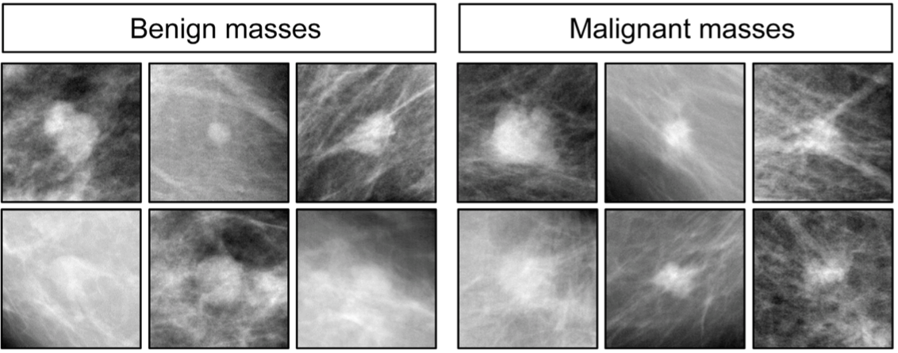

Clinicians spend years training to accurately interpret medical imaging like X-rays in order to recognize and diagnose diseases. However, a recent research article identifies an unlikely candidate for interpreting medical images: *Columba livia*, an animal you might recognize as the common pigeon. Researchers in this study showed that, with food reward and several days of practice, it is possible to train pigeons to tell the difference between healthy and cancerous tissue.

###Pigeons can learn to distinguish medical images like humans do.

Many studies have demonstrated that pigeons share several aspects of the human visual system, including the ability to distinguish letters of the alphabet or human faces. Furthermore, people and pigeons have similar brain wiring. Based on these similarities, a team of scientists wanted to test whether pigeons could learn to differentiate images from normal and disease conditions, even though it is impossible to verbally explain the differences to a pigeon [^1]. More importantly, the authors of this study hoped to demonstrate whether pigeons were capable of **generalizing** what they learned to new images that they were shown, as opposed to just **memorizing** the correct answer for images they had already seen.

In this study, pigeons were isolated in testing environments and shown only a touch screen. The touch screen displayed a medical image in the center with colored rectangles on both sides (one blue and one yellow) that served as buttons for choosing how to classify the image (where blue might mean “cancerous” and yellow might mean “normal”). In response to a correct choice, a food dispenser would provide a reward to the pigeon.

**Figure 1: Experimental set-up for training pigeons to diagnose medical
images.**

The researchers tested the pigeons’ ability to diagnose normal (benign) or cancerous (malignant) tissue in two separate scenarios: 1) histology (stained tissue sections) samples from patients with or without breast cancer and 2) mammograms (X-ray images) of tissue with or without microcalcifications, which indicate the presence of breast cancer. Within days, the birds were able to recognize the differences in a **training set** of images, but they could also **generalize** what they had learned to classify new images with great accuracy. Even when these images were changed to different levels of magnification, rotated, compressed, or color- and contrast-adjusted, the pigeons were still able to learn how to correctly classify images based on disease status with additional practice.

**Figure 2: Example annotated images from histology slides for both benign or normal breast tissue and malignant or cancerous breast tissue.**

However, when it came to a more challenging task, such as identifying whether tissue masses in an X-ray image were benign or malignant, the pigeons did poorly. Even for humans, becoming proficient in this task requires years of training and the difference is still considered difficult to recognize among medical experts. Despite weeks of training, the pigeons could only accurately classify images they had been previously shown based on memory, but did no better than random guessing when given the task of diagnosing new images. These results show that pigeons are able to visually process medical images similarly to people. Specifically, the birds learned to recognize some of the differences between healthy and unhealthy tissues with practice, but they struggled with tasks that even doctors consider difficult.

**Figure 3: Example annotated images from mammograms for both benign or normal masses and malignant or cancerous masses.**

###Trained pigeons can be used to test and refine medical image processing software.

How are these findings useful for medicine? Will we be using pigeons in the clinic to diagnose illnesses? While we may not yet rely on pigeons to interpret medical images for us, proof that pigeons can learn, like humans, to recognize the difference between healthy and unhealthy tissue is quite useful. In fact, **pigeons are great models for “human observers”** to design better computer software that helps doctors classify disease in medical images or that directly diagnoses a patient from imaging without consulting a doctor.

A lot of image acquisition and analysis software has been developed to help doctors interpret medical images. The goal of most of this software is to automatically preprocess the image so that the user (a doctor) can more readily discern the differences in the image to make a diagnosis. This software is updated constantly and these changes need to be rigorously tested to ensure that the doctor can make more accurate diagnoses. However, it is difficult to test every single update with humans because recruiting clinicians to perform long, repeated studies is expensive and inconvenient. In contrast, trained pigeons can tolerate repeated testing, which is necessary to demonstrate real differences in performance. The results we get from testing pigeons could thus improve the image analysis software, maximizing the accuracy of doctors’ diagnoses.

###Understanding how pigeons perceive medical images can improve algorithms that automatically diagnose disease from images.

Knowing that pigeons and people classify medical images in similar ways, we can figure out how to use experiments with trained pigeons to improve machine learning algorithms. **Machine learning algorithms** allow a computer to learn to perform a task from practice data, much like the pigeons learned to diagnose medical images. However, designing this algorithm is difficult when the task involves analyzing images since computers do not perceive images the same way people do. With the knowledge gained from the pigeon experiments, we could instruct computers to look for the same image features that pigeons look for to successfully classify an image. Going back to the original study, some images presented to the pigeons were gray-scale or compressed. Though the pigeons initially classified these images inaccurately, they were able to adapt and accurately classify the modified images. Thus, tweaking images and determining when pigeons can no longer distinguish normal samples from cancerous samples could identify which features are **necessary** for accurate classification.

Teaching computers to classify medical images would then work similarly to how pigeons are trained in the research study. Just as pigeons are presented with annotated example images, computers also learn from a **training set of images**. Specifically, the computer assesses how the presence or absence of image features correlates with disease classification in the images. For example, a computer may be told that cell density is important. The computer would then measure cell density in all examples and learn that density is greater in cancerous tissue than in normal tissue. If the computer sees a new image, it would guess that the image shows cancerous tissue if the cell density is high. From practice, the computer develops a **model**, or a notion of what features are important and how they correlate with disease status. In this way, computers can learn to automatically guess disease status based on what pigeons look for.

**Figure 4: Overview of a machine learning algorithm for image analysis, including how it is trained to classify disease status from a medical image and how it is applied to new images.**

Though we may be several years out from having non-humans (pigeon or computer) in the doctor’s office to detect cancer in medical imaging, the discovery that we can use pigeons to study human visual perception will pave the way to developing better computational image analysis tools that help doctors diagnose their patients. Machine learning offers many exciting advancements from self-driving cars to anti-spam programs in your email. However, some of the most promising machine learning applications are in healthcare, including patient diagnostics. Though it may be unexpected, experiments using trained pigeons may provide the critical information that can make automatic diagnosis from medical imaging a reality.

[^1]: Levenson et al. *PLoS ONE* 2015
