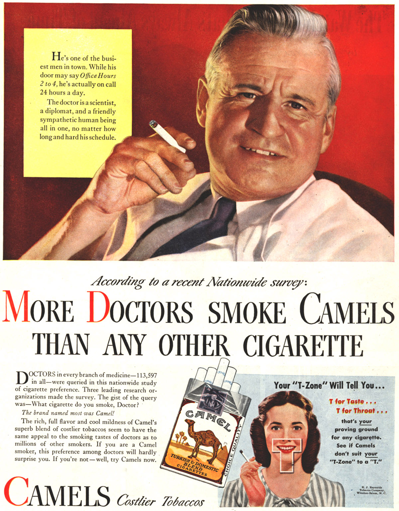

> Written with [StackEdit](https://stackedit.io/).
> #**SMOKING -** *A retrospective on the discovery of the link between cigarettes and lung cancer*
> 
> Written by **Julien Roth** 
> Illustration by **Andrea Chaikovsky**
> ####Introduction
> Consider for a moment the following claim, **_"More doctors smoke Camel than any other cigarette"._** If you found that statement to be alarming for any reason besides a personal preference for Marlboro, you would have found yourself in the minority in America in the 1940’s. This claim was the refrain of one of many now infamous advertising campaigns from 1940’s as American tobacco companies attempted to invoke a sense of benignity and scientific legitimacy around their products. **At the time this ad was released, approximately 40% of American adults smoked cigarettes.** While this number would rise during the 1950’s and peaked in the early 1960’s, **the percent of Americans who smoke cigarettes as of 2014 was 16.8%.** This drastic shift in smoking prevalence is one of the most important public health achievements in America in the past century. Scientists, from a variety of countries and fields, played a critical role in both instigating and ensuring the legacy of the anti-smoking campaign. This article will chronicle the work of a select subset of these scientists and reveal how their accomplishments influenced a nation.
> 
> ####An Abridged History of the Recognition of Tobacco Carcinogenesis 
> The turn of the 20th century brought with it a marked increase in the diagnosis of lung cancer, a disease once so rare physicians considered witnessing it to be a once in a lifetime event. This increase prompted **Isaac Adler** to investigate the <a href="#definitions" title="The cause or origin of a disease.">**etiology**</a> of lung cancer. In Primary Malignant Growths of the Lungs and Bronchi, published in 1912, Adler, a physician and teacher affiliated with several New York City hospitals, proposed a series of possible culprits including tobacco abuse. Unfortunately, **Alder’s supposition that smoking caused cancer was largely ignored**, and 20 years passed before the field would make any significant progress. 

> **Angel Honorio Roffo**, an Argentinian physician and pioneer in the field of tobacco <a href="#definitions" title="The production or development of cancer.">**carcinogenesis**</a>, published a series of articles in the 1930’s demonstrating a causative link between condensed tobacco smoke and tumor formation. Roffo’s work acted as a foundation upon which **Ernst Wynder and Evarts Graham** (initially a skeptic and heavy smoker himself) published a number of <a href="#definitions" title="The science concerned with the study of the factors determining and influencing the frequency and distribution of disease in a defined human population.">**epidemiological**</a> reports and animal investigations. The pair of researchers published a landmark study in 1950 in which they retrospectively interviewed 684 patients with <a href="#definitions" title="Another, if somewhat outdated, name for lung cancer.">**bronchiogenic carcinoma**</a>. In the conclusion, **they unambiguously linked smoking tobacco to lung cancer.** In their most well-known animal experiment, Wynder and Graham (Adele Croninger was also listed as a co-author) used a ‘Cigarette Smoking Machine’ to simultaneously smoke 100 cigarettes and collect the by-product – a condensed cigarette tar stored in acetone. This tar/acetone solution was then painted onto the shaved backs of the experimental mouse group three times a week until they died.  These mice developed <a href="#definitions" title="A tumorous growth that is usually benign (won’t spread throughout the body).">**papillomas**</a> and <a href="#definitions" title="A cancer that begins in a single cell of a tissue that lines part of the body, for example your skin or the lining of your lung.  This mutated single cell develops into a malignant tumor of many cells that can then spread throughout the body.">**carcinomas**</a> at sites of application. The results of these experiments confirmed, in the eyes of Wynder, Graham, and several influential news organizations, the link between cancer and tobacco. The widespread media attention that these studies received triggered many Americans, including Graham, to give up smoking which in-turn caused stock prices of American cigarette manufactures to tumble. Graham would, in a letter written to Wynder in 1957, lament his earlier skepticism. He died of lung cancer several weeks later.

> 
> ####The Response of the Tobacco Industry
> By the late 1940’s the tobacco industry decided to turn to public relations, a field through which they had achieved great success in years past, to assuage what was an unprecedented threat to their very existence. **John W. Hill**, president of one of the nation’s leading public relations firms, was called upon to guide the industry through this crisis. Instead of turning away from science, Hill **advised the tobacco industry gain control over the science and publicly embrace a principal foundation of science, skepticism**. By funding the work of academic scientists, Hill believed the industry could both solicit and amplify the views of skeptics and, more importantly, convey to the public that the tobacco companies were actively engaging in substantive research. The results of these studies were less relevant to Hill’s plan; he placed greater emphasis on the simple idea that there was more research to be done and, by extension, that the question of whether or not smoking caused lung cancer was exactly that, a question.

>It is important to note that much of the research commission by the tobacco industry actually corroborated the notion that cigarette smoking was carcinogenic. For example, in 1952 researchers at the **Brown and Williamson Tobacco Corporation identified dozens of carcinogens in tobacco smoke.** Furthermore, in private reports made for executives in several tobacco companies, researchers concluded that the confluence of clinical and animal studies purporting a link between smoking and lung cancer clearly suggested that tobacco was carcinogenic. **_None of these studies or reports were made public_**, instead the tobacco industry invested more money in creating propaganda which denied or at least questioned the cigarette-cancer link. 
> ####The 1964 Surgeon General Report
> As the evidence linking smoking cigarettes to lung cancer continued to mount, and public opinion began to shift from disregard to concern, the <a href="#definitions" title="Nominated by the President of the United States and confirmed by the Senate, the Surgeon General acts as the spokesperson for the federal government on matters of public health. ">**Surgeon General**</a> began to take steps to elucidate the position of the US government. In 1957, Surgeon General **Leroy Burney** took the first step by declaring that there may be a causal link between smoking and lung cancer. In an effort to avow a more concrete position, the U.S. Public Health Service convened a committee of experts which, over a span of two years (1962 to 1964), poured over 7,000 research papers. 

>Their conclusions were presented in the first Surgeon General Report which was published in 1964. According to the Surgeon General at the time, **Luther Terry**, the report, *“hit the country like a bombshell. It was front page news and a lead story on every radio and television station in the United States and many abroad."* Of the many findings presented in the report, the claim that regular **cigarette smoking resulted in a 70% increase in mortality** rates really stuck with the American public. 

> The report also influenced politicians. In 1965, Congress passed the Federal Cigarette Labeling and Advertising Act which required a health warning on all cigarette packages. Then in 1969, the Public Health Cigarette Smoking Act was passed which banned cigarette advertising across all forms of broadcast media. 
> ####Conclusion
> Public opinion on smoking shifted significantly between the 1940’s and 1960’s as a result of the tireless work of a cadre of dedicated scientists. Their research has undoubtedly saved the lives of millions of people, yet the question remains, how many million more could have been saved if the tobacco industry had been more honest and spent less on undermining the science they knew was true. 
####Recommended Further Reading
* Proctor RN. The history of the discovery of the cigarette e lung cancer link : evidentiary traditions , corporate denial , global toll. Tob Control. 2012;21:87-91. doi:10.1136/tobaccocontrol-2011-050338.

* Brandt A. Inventing Conflicts of Interest : A History of Tobacco Industry Tactics. 2012;102(1):63-71. doi:10.2105/AJPH.2011.300292.  

* Cummings KM, Brown A, Connor RO. CEBP Focus : Nicotine and Tobacco-Control Research The Cigarette Controversy. Cancer Epidemiol Biomakers. 2007;16(June):1070-1076. doi:10.1158/1055-9965.EPI-06-0912.  

####Definitions {#definitions}

*Etiology* 														                               
: The cause or origin of a disease. 

*Carcinogenesis*
: The production or development of cancer. 

*Epidemiology (Epidemiological)*
: The science concerned with the study of the factors determining and influencing the frequency and distribution of disease in a defined human population.

*Bronchogenic carcinoma*
: Another, if somewhat outdated, name for lung cancer. 

*Papilloma*
: A tumorous growth that is usually benign (won’t spread throughout the body).

*Carcinoma*
: A cancer that begins in a single cell of a tissue that lines part of the body, for example your skin or the lining of your lung.  This mutated single cell develops into a malignant tumor of many cells that can then spread throughout the body.

*Retrospective study*
: An epidemiologic study in which participants are classified as either having some outcome (cases) or lacking it (controls); the outcome may be a specific disease, and the persons' histories are examined for specific factors that might be associated with that outcome.

*Prospective study*
: An epidemiologic study in which the groups of individuals (cohorts) are selected on the bases of factors that are to be examined for possible effects on some outcome. The cohort is selected in the present and followed into the future.

*Surgeon General*
: Nominated by the President of the United States and confirmed by the Senate, the Surgeon General acts as the spokesperson for the federal government on matters of public health. 
